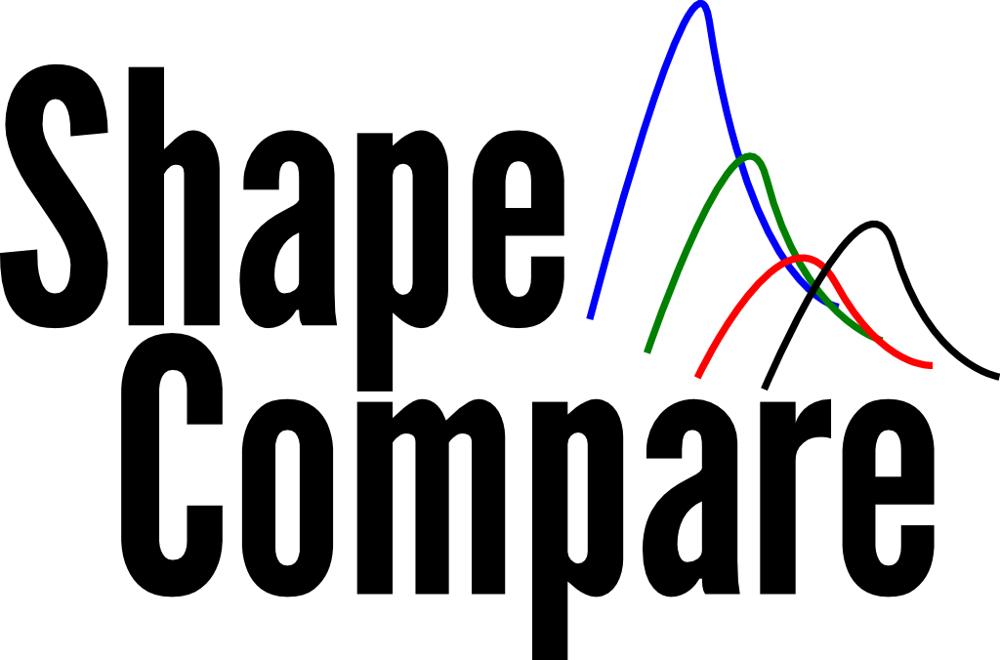

ShapeCompare
============
A tool to visualize and compare multiple SHAPE experiment data.

Copyright (C) 2012, 2013  Guilhem DOULCIER

ShapeCompare is a free software for GNU/Linux, Mac OS and Windows made to visualize and compare results of high-throughput Selective 2′-Hydroxyl Acylation analyzed Primer Extension (hSHAPE) experiments. 

Features
------
See http://www.eleves.ens.fr/home/doulcier/shapecompare/ for an overview.

Usage
------
`python cli.py folders...  [PARAMETERS]...`

`./cli.py folders...  [PARAMETERS]...`

- folders... :  *.shape folder(s) from Shape Finder or folder(s) containing multiple *.shape folders.

*PARAMETERS*

- -v : verbose mode
- -l : license information

### Example
All experiments in the data_coreset folder:
`./cli.py ../data/shape/data_coreset/ -v `

One file only:
`./cli.py ../data/shape/data_coreset/7SKWT_RTH_MC5_fit.shape/ `

Options 
-------
You can modify several aspect of shapeCompare behavior by editing the `options.py` file. 

Requirement
----------
ShapeCompare is written in python 2.7 and needs the following library :

-    Numpy and Scipy
-    Matplotlib

 

License
------

This program is free software: you can redistribute it and/or modify
it under the terms of the GNU General Public License as published by
the Free Software Foundation, either version 3 of the License, or
(at your option) any later version.

This program is distributed in the hope that it will be useful,
but WITHOUT ANY WARRANTY; without even the implied warranty of
MERCHANTABILITY or FITNESS FOR A PARTICULAR PURPOSE.  See the
GNU General Public License for more details.

You should have received a copy of the GNU General Public License
along with this program.  If not, see <http://www.gnu.org/licenses/>.
